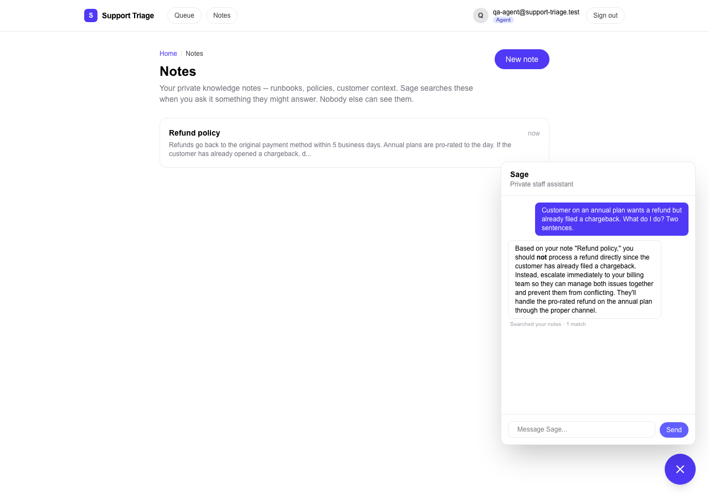

# Support Ticket Triage

A support ticketing app -- customers file tickets, agents work a queue, admins run the team --
built around an **AI triage agent**. Every new ticket is assessed by an LLM the moment it's
filed, so an agent opening the queue already knows what each ticket is about, how urgent it is
and why, which team should own it, whether it's a repeat of something already open, and how they
might start replying.

**Live:** https://support-triage-app-one.vercel.app (requires sign-in; open it in an incognito
window and you land on the login page, never on data).


## Why the AI feature is the core, not a bolt-on

Without triage this is a plain CRUD ticket form -- a queue of subjects sorted by date. The value
of the product is that a human never has to read a ticket cold:

- **Category, priority and a stated reason.** Not just "high" but *"paying customer reports a
  duplicate charge with the order number provided; clear financial impact"*.
- **Team routing** (support / billing / engineering).
- **Duplicate and related-ticket detection** via pgvector similarity search over previous tickets.
- **Frustration score and escalation-risk flag.**
- **A draft first reply** that acknowledges the specifics and asks for whatever is missing --
  shown to the agent, never sent automatically.
- **"Still needed from the customer"** so the agent's first message is the right question.

Remove it and the app has no reason to exist over a shared inbox.

The AI is deliberately **advisory**: it seeds a staff-only working-state record (priority,
category, team) and records its full assessment in an append-only audit table, but it never
changes ticket status and never sends anything to a customer. Nothing it produces is readable by
the customer who filed the ticket -- not in the UI and not through the database API.

## Sage: the staff assistant that can read your notes

Agents and admins also get **Sage**, a floating assistant on every staff page. It remembers the
conversation (persisted per staff member), and it can **search that staff member's own private
notes** -- runbooks, policies, customer context written under **Notes** -- to answer from them:

- **Agentic RAG, not a fixed pipeline.** `search_notes` is a tool the model chooses to call. A
  general-knowledge question is answered directly with no retrieval; a question about "our refund
  policy" triggers a search, and a poor first result gets a rewritten query and a second search.
- **Cited, or honest.** Answers drawn from notes name the note (*Based on your note "Q3 launch
  logistics", ...*), and when nothing relevant exists Sage says so instead of guessing.
- **Per-user by construction.** Notes are chunked and embedded (`openai/text-embedding-3-small`,
  pgvector) with the owner's id on every chunk; the similarity-search function scopes to the
  calling session's `auth.uid()` and runs under RLS, so there is no request that returns another
  staff member's chunks -- verified by a two-account test that also calls the RPC directly.



Design and calibration notes: `docs/notes-rag.md`.

## Stack

Next.js 16 (App Router) · TypeScript · Tailwind · Supabase (Postgres + Auth + RLS + pgvector) ·
OpenRouter (`anthropic/claude-haiku-4.5` for assessment, `openai/text-embedding-3-small` for
embeddings) · Vercel.

## Security model (baseline, not the centrepiece)

- Three roles (`customer` / `agent` / `admin`) enforced by **RLS on every table**, not UI checks.
  Customers see only their own tickets; agents see unassigned tickets and their own; admins see all.
- Role changes only through a `SECURITY DEFINER` RPC that refuses self-changes and demoting the
  last admin. Signup **hard-codes** `customer` and ignores client metadata.
- A `BEFORE UPDATE` trigger enforces what RLS can't: immutable ticket text, legal status
  transitions, staff-only assignees, race-free claiming.
- CSRF via Server Actions' built-in Origin/Host check; **no mutating Route Handlers exist** (the
  only Route Handler, `GET /account/export`, is read-only).
- GDPR data rights are self-service on `/account`: a JSON **export** of everything the caller can
  see (an RLS-scoped `SECURITY INVOKER` function) and **real account deletion** -- the `auth.users`
  row goes and every table cascades; a trigger refuses to delete the last admin, and a departed
  staff member's replies stay on customers' tickets unattributed rather than vanishing.
- Per-user **rate limiting** in Postgres + a Vercel WAF rule; security headers incl. a CSP.
- `OPENROUTER_API_KEY` and `SUPABASE_SERVICE_ROLE_KEY` are read only in `server-only` modules.
  Ticket text is treated as untrusted model input (closed strict schema, delimited, candidate-
  restricted ids). See `docs/ai-triage.md` for the prompt-injection and privacy analysis.

Full schema, policies and functions: `docs/supabase-schema.md`.

## Run it locally

```bash
npm install
cp .env.example .env.local   # then fill in the values below
npm run dev                  # http://localhost:3000
```

| Variable | Where to get it | Exposed to browser? |
|---|---|---|
| `NEXT_PUBLIC_SUPABASE_URL` | Supabase Dashboard -> Project Settings -> API -> Project URL | Yes (by design) |
| `NEXT_PUBLIC_SUPABASE_ANON_KEY` | Same page -> `anon` / publishable key | Yes (by design; RLS protects data) |
| `SUPABASE_SERVICE_ROLE_KEY` | Same page -> `service_role` (secret). Bypasses RLS. | **Never** |
| `OPENROUTER_API_KEY` | https://openrouter.ai -> Keys | **Never** |
| `NEXT_PUBLIC_SITE_URL` | `http://localhost:3000` locally; the deployed URL in production | Yes |

Database setup (one-time, needs the Supabase CLI which is a dev dependency):

```bash
npx supabase login
npx supabase link --project-ref <your-project-ref>
npx supabase db push          # applies supabase/migrations/ in order
```

Then in the Supabase dashboard: **Settings -> API -> Data API -> Exposed schemas** -> add
`ticketing`. This app keeps every table in its own `ticketing` schema (it shares a Supabase
project with another app -- see `docs/supabase-schema.md` for why and what that implies).

Make yourself admin once you've signed up (SQL editor):

```sql
update ticketing.profiles set role = 'admin' where email = 'you@example.com';
```

Without `OPENROUTER_API_KEY` the app runs normally and tickets simply stay `pending` triage.

## Tests

```bash
npx playwright install chromium
npx playwright test
```

The suite runs against the real Supabase project and, for the AI test, the real OpenRouter API.
It needs dedicated test accounts in `.env.local` (`TEST_USER_*` customer A, `TEST_USER_B_*`
customer B, `TEST_AGENT_*`, `TEST_ADMIN_*`, `TEST_ROLEFLIP_EMAIL`) -- create them with the Supabase
Admin API (`auth.admin.createUser` with `email_confirm: true`) and set roles via the service role.
Coverage: customer flow; **cross-user isolation** (customer B gets a 404 for customer A's ticket);
agent claim / status / internal notes hidden from the customer; **AI triage happy path** with the
panel never rendered for customers; admin role gate, role changes, reassignment; agent 404 for
another staff member's ticket; customer bounced from staff routes; **Sage** conversation memory
and persistence across a refresh; **notes RAG** -- answer-and-cite from a saved note, "nothing
relevant" honesty, no search for general knowledge, and **cross-staff isolation** of notes in both
the chat and a direct call to the retrieval RPC.

## Optional tasks completed

Eight optional tasks across both sprint projects' lists, spanning all three difficulty tiers.

**Easy**

- **Model display** -- the triage panel shows the exact OpenRouter slug, prompt version, and
  latency for every run.
- **Usage/cost indicator** -- the real cost OpenRouter billed for each triage run (embedding +
  completion, from `usage.cost` on the response, not an estimate), shown per ticket and as a
  running total on the admin overview.
- **Security headers configured** (mid-sprint list) -- a same-origin CSP, HSTS with `preload`,
  `X-Frame-Options: DENY`, `X-Content-Type-Options: nosniff`, Referrer-Policy, and
  Permissions-Policy, applied to every route including the public share page.

**Medium**

- **Deploy to a live Vercel URL** -- secrets live only in the Vercel dashboard, never in the repo
  or a `NEXT_PUBLIC_` variable.
- **Playwright tests for the AI feature** -- a real LLM call asserted end to end (never mocked),
  plus the signed-out lockout and cross-user checks running against the live database.
- **Two-user cross-account test** (mid-sprint list) -- a second real customer account (created via
  the Admin API) attempting to reach the first customer's ticket by direct URL, confirmed blocked
  with a 404, not a login bounce.

**Hard**

- **Agentic RAG** -- Sage's `search_notes` is a tool the model chooses to call, not a fixed
  retrieval step: it skips the search for general-knowledge questions, rewrites the query and
  searches again when the first results are poor, cites the note it used by title, and says so
  when nothing relevant exists. Chunks are embedded with `openai/text-embedding-3-small` into a
  pgvector `documents` table; the match function scopes to the caller's `auth.uid()` and runs
  under RLS, so there is no user-id argument to spoof. Verified with a two-account test in the
  chat and against the RPC directly (`docs/notes-rag.md`).
- **Shareable AI outputs** -- staff can publish a read-only public status page (subject, status,
  and the AI-generated summary) to an unguessable URL. An unauthenticated visitor can view that
  one snapshot and nothing else: no comments, no ticket body, no other tickets, no sign-in prompt.
  The table backing it is never exposed to `anon` through the Data API at all -- the public page
  reads it server-side with the service role, by exact 128-bit token match only, with its own
  IP-keyed rate limiter since it's the app's only unauthenticated route. Staff can unpublish at
  any time (one-directional -- a raw API call can't silently un-revoke a link), after which the
  link 404s, and shares expire automatically after 30 days.

## Docs

- `docs/ai-triage.md` -- pipeline, schema, prompt-injection and privacy analysis (cites OpenRouter
  and Supabase sources).
- `docs/notes-rag.md` -- Sage's notes retrieval: chunking, the tool loop, threshold calibration,
  and why the match function takes no user id.
- `docs/supabase-schema.md` -- every table, policy, trigger and function.
- `docs/security/` -- security audit reports: four fresh-context passes, each with its fixes
  recorded, ending in a clean rescan (0 critical, 0 warning) before merge.
- `docs/reviews/` -- `ai-code-reviewer` report recorded before merging the PR.
- `CLAUDE.md` -- the AI rules and conventions the codebase is built to.
